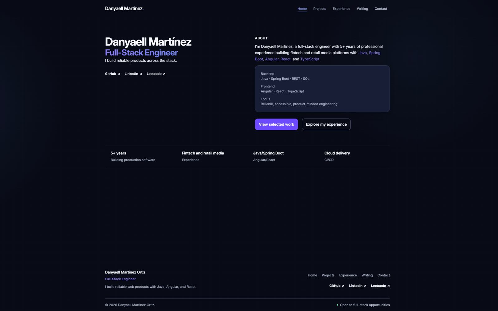

# Danyaell Martinez — Portfolio

[](https://github.com/Danyaell/portfolio/actions/workflows/ci.yml)

A statically generated professional portfolio built with Angular, TypeScript, and Tailwind CSS.

The site presents my full-stack engineering experience, selected projects, technical writing, and contact information. It is designed as both a public portfolio and a practical demonstration of frontend architecture, semantic design systems, accessibility, static content generation, testing, SEO, and automated delivery.

[View the live portfolio](https://danyaell-martinez.vercel.app)



## Overview

This repository contains the source code and content for my personal engineering portfolio.

The application is intentionally content-driven and mostly static:

- Projects are stored in a shared, typed, readonly data source.
- Professional experience is maintained in a shared experience data source.
- Blog posts are written locally in Markdown and converted into typed TypeScript data at build time.
- Angular prerenders every public route into HTML.
- Route components are lazy-loaded.
- No runtime CMS, database, GitHub API, or external content service is required.
- SEO metadata is generated during prerendering.
- GitHub Actions validates content, formatting, tests, accessibility behavior, production builds, prerendered HTML, routes, and required assets.

## Current features

### Home

The Home page provides a compact overview of the complete portfolio:

- Hero and primary value proposition.
- Professional evidence strip.
- Featured projects derived from the shared project collection.
- Engineering capabilities across frontend, backend, and delivery.
- Selected professional experience.
- Latest published writing.
- Contact call to action.

Home does not duplicate project, experience, or article content. Its sections derive their information from the same sources used by their corresponding full pages.

### Projects

The Projects section includes:

- A complete project index.
- Reusable project cards.
- Project covers with explicit intrinsic dimensions.
- Roles, summaries, technology stacks, and engineering highlights.
- Live demo and repository actions where available.
- Statically generated project walkthrough routes.
- Project-specific titles and social metadata.

Current project data includes:

- Maverick Labs.
- This portfolio.

### Experience

The Experience page is generated from a typed, readonly collection and includes:

- Company and client information.
- Engagement type.
- Role and time period.
- Location.
- Contextual summaries.
- Verifiable achievements.
- Technologies used in each experience.

The same collection powers the compact experience preview on Home.

### Writing

Blog articles are authored as local Markdown files.

At build time, the content pipeline:

1. Reads Markdown files from `src/content/posts`.
2. Parses YAML front matter with `gray-matter`.
3. Validates required fields and slug formatting.
4. Excludes articles marked as drafts.
5. Converts Markdown to HTML with `marked`.
6. Sorts posts by publication date.
7. Generates a typed readonly collection.
8. Uses the generated collection for the blog index, Home preview, route parameters, and article pages.

### Contact

The Contact page provides direct, accessible ways to get in touch without requiring a runtime backend or embedding a form on the Home page.

### Not-found experience

Unknown routes display an accessible not-found page with navigation back to Home and Projects.

## Technology stack

| Area                  | Technologies                                          |
| --------------------- | ----------------------------------------------------- |
| Framework             | Angular 22                                            |
| Language              | TypeScript 6                                          |
| Styling               | Tailwind CSS 4, PostCSS                               |
| Typography            | Inter Variable                                        |
| Routing               | Angular Router with lazy-loaded standalone components |
| Rendering             | Angular static generation and prerendering            |
| Hydration             | Angular client hydration                              |
| Content               | Markdown, gray-matter, marked                         |
| Testing               | Angular unit testing, Vitest, JSDOM                   |
| Accessibility testing | axe-core                                              |
| Code quality          | ESLint, Angular ESLint, Prettier                      |
| Automation            | GitHub Actions                                        |
| Deployment            | Vercel                                                |

## Architecture

The application is organized by feature rather than by generic technical type.

```text
.
├── .github/
│   └── workflows/
│       └── ci.yml
├── public/
│   ├── fonts/
│   ├── images/
│   │   ├── projects/
│   │   └── social/
│   ├── apple-touch-icon.png
│   ├── favicon.ico
│   ├── favicon.svg
│   ├── robots.txt
│   └── sitemap.xml
├── scripts/
│   ├── generate-content.mjs
│   └── verify-home-prerender.mjs
├── src/
│   ├── app/
│   │   ├── blog/
│   │   ├── contact/
│   │   ├── experience/
│   │   ├── generated/
│   │   ├── home/
│   │   ├── layout/
│   │   ├── not-found/
│   │   ├── projects/
│   │   ├── seo/
│   │   ├── app.config.server.ts
│   │   ├── app.config.ts
│   │   ├── app.routes.server.ts
│   │   └── app.routes.ts
│   ├── content/
│   │   └── posts/
│   ├── index.html
│   └── styles.css
├── angular.json
├── package.json
└── tsconfig.json
```

### Shared data flow

```text
projects.data.ts
├── Home featured projects
├── Projects index
├── Project walkthrough pages
└── Project prerender parameters

experience.data.ts
├── Home experience preview
└── Full Experience page

src/content/posts/*.md
└── generate-content.mjs
    └── generated/blog-posts.ts
        ├── Home writing preview
        ├── Blog index
        ├── Article pages
        └── Article prerender parameters
```

The generated `src/app/generated/blog-posts.ts` file must not be edited manually.

## Routes

| Route             | Purpose                          | Rendering                        |
| ----------------- | -------------------------------- | -------------------------------- |
| `/`               | Homepage                         | Prerendered                      |
| `/projects`       | Complete project collection      | Prerendered                      |
| `/projects/:slug` | Project walkthrough              | Prerendered from `PROJECTS`      |
| `/experience`     | Complete professional experience | Prerendered                      |
| `/blog`           | Published writing                | Prerendered                      |
| `/blog/:slug`     | Individual article               | Prerendered from generated posts |
| `/contact`        | Contact options                  | Prerendered                      |
| `**`              | Accessible not-found page        | Router fallback                  |

Dynamic project and blog paths are resolved at build time through `app.routes.server.ts`.

Unknown project or article slugs are not generated as valid static routes.

## Rendering strategy

The application uses Angular's application builder with:

```json
{
  "outputMode": "static"
}
```

Every known public page is converted into HTML during the production build. This gives visitors meaningful content before JavaScript executes and allows search engines and social crawlers to access titles, descriptions, headings, links, and article content directly.

The static browser output is generated under:

```text
dist/portfolio/browser
```

The application also enables client hydration for subsequent interaction and navigation.

## SEO

SEO behavior is centralized under:

```text
src/app/seo/
```

The implementation includes:

- Page-specific document titles.
- Meta descriptions.
- Canonical URLs.
- Open Graph titles, descriptions, URLs, types, images, dimensions, and alternative text.
- Twitter card metadata.
- Theme color.
- Person JSON-LD on Home.
- GitHub and LinkedIn profiles through `sameAs`.
- Dynamic metadata for project and article pages.
- Metadata cleanup when navigating between pages.
- `robots.txt`.
- XML sitemap.
- Production favicon assets.
- Prerender verification for essential Home metadata.

Static routes declare their metadata in `app.routes.ts`. Dynamic project and article pages derive their metadata from their corresponding shared content sources.

### Changing the production domain

The production origin is currently:

```text
https://danyaell-martinez.vercel.app
```

If the site moves to another domain, update all domain-dependent references in:

```text
src/app/seo/seo.config.ts
public/robots.txt
public/sitemap.xml
scripts/verify-home-prerender.mjs
```

After changing the domain, run the complete validation pipeline and inspect the prerendered HTML again.

## Accessibility

Accessibility is treated as a functional requirement rather than an optional visual enhancement.

The application includes:

- Semantic page landmarks and heading hierarchies.
- A keyboard-accessible skip link.
- Visible `:focus-visible` states.
- Minimum interactive target heights.
- Responsive navigation with accessible state communication.
- Focus movement to the main content after route navigation.
- Descriptive image alternative text.
- Screen-reader notices for links that open new tabs.
- Semantic lists for projects, technologies, achievements, and navigation.
- Support for forced-color environments.
- Reduced-motion behavior through `prefers-reduced-motion`.
- Automated axe checks for the application shell, responsive header, Home page, featured project cards, and contact CTA.

Automated checks complement manual verification with:

- Keyboard-only navigation.
- 200% browser zoom.
- Narrow viewports.
- Forced colors.
- Reduced motion.
- Heading-order inspection.
- Contrast and interactive-state review.

## Design system

The visual system is defined through semantic CSS custom properties in `src/styles.css`.

The design uses the Midnight Violet theme:

- Dark canvas and layered surfaces.
- Violet and blue brand accents.
- Semantic ink, border, action, feedback, and focus colors.
- Fluid typography.
- Responsive layout gutters.
- Shared card and button radii.
- Shared elevation tokens.
- Short UI transitions.
- A reusable `site-container` layout utility.

Tailwind consumes these semantic values through `@theme`, allowing templates to use utilities such as:

```text
bg-canvas
bg-surface
text-ink
text-ink-muted
text-brand-violet
border-border
rounded-card
rounded-button
```

This keeps visual decisions separate from project and experience domain data.

### Typography

The site uses the normal Inter Variable font with weights from `100` to `900`.

The font:

- Is self-hosted.
- Is preloaded from `src/index.html`.
- Uses `font-display: swap`.
- Does not load a separate italic file.
- Falls back to system UI fonts if unavailable.

## Performance decisions

The site is intentionally lightweight and mostly static.

Current performance-oriented decisions include:

- Lazy-loaded route components.
- Static generation for every known route.
- No runtime content fetching.
- No runtime GitHub API.
- No animation library.
- No sliders or carousels.
- No initial IntersectionObserver-based effects.
- `NgOptimizedImage` for project images.
- Explicit image dimensions to reduce layout shifts.
- WebP project covers.
- A single priority image only where the image is visible on initial load.
- Output hashing for production assets.
- Angular bundle budgets.
- Reduced motion support.
- A pointer-based ambient effect that only runs for precise pointer devices when reduced motion is not requested.

Production bundle budgets are configured as:

| Budget           | Warning | Error |
| ---------------- | ------: | ----: |
| Initial bundle   |  500 kB |  1 MB |
| Component styles |    4 kB |  8 kB |

## Requirements

Use the versions declared by the repository:

- Node.js `24.15.0`.
- npm `11.16.0`.

The supported Node range is:

```text
>=24.15.0 <25.0.0
```

If you use `nvm`:

```bash
nvm install
nvm use
```

No environment variables, database, CMS, or external API credentials are required to run the project.

## Getting started

Clone the repository:

```bash
git clone https://github.com/Danyaell/portfolio.git
cd portfolio
```

Select the configured Node version:

```bash
nvm use
```

Install dependencies:

```bash
npm ci
```

The `postinstall` script automatically generates the typed blog-post collection.

Start the development server:

```bash
npm start
```

Open:

```text
http://localhost:4200
```

The application reloads automatically when source files change.

## Available scripts

| Command                       | Purpose                                                                                      |
| ----------------------------- | -------------------------------------------------------------------------------------------- |
| `npm start`                   | Generate content and start the Angular development server                                    |
| `npm run content:generate`    | Generate the typed blog-post collection from Markdown                                        |
| `npm run build`               | Generate content and create a production build                                               |
| `npm run watch`               | Build continuously using the development configuration                                       |
| `npm test`                    | Run unit tests in watch mode                                                                 |
| `npm run test:ci`             | Run the complete test suite once                                                             |
| `npm run lint`                | Run ESLint against TypeScript and Angular templates                                          |
| `npm run format`              | Format the repository with Prettier                                                          |
| `npm run format:check`        | Verify formatting without modifying files                                                    |
| `npm run verify:prerender`    | Inspect the generated Home HTML and production metadata                                      |
| `npm run validate`            | Run content generation, linting, formatting checks, tests, build, and prerender verification |
| `npm run serve:ssr:portfolio` | Serve the generated Angular server bundle after building                                     |

## Adding a project

Projects are maintained in:

```text
src/app/projects/projects.data.ts
```

Each project must satisfy the `PortfolioProject` interface:

```ts
interface PortfolioProject {
  readonly slug: string;
  readonly name: string;
  readonly summary: string;
  readonly role: string;
  readonly stack: readonly string[];
  readonly highlights: readonly string[];
  readonly featured: boolean;
  readonly coverImage: string;
  readonly coverImageWidth: number;
  readonly coverImageHeight: number;
  readonly coverImageAlt: string;
  readonly liveUrl?: string;
  readonly repositories: readonly ProjectRepository[];
}
```

To add a project:

1. Add its optimized cover image under `public/images/projects`.
2. Add one object to `PROJECTS`.
3. Use a unique lowercase kebab-case slug.
4. Provide the image's real intrinsic width and height.
5. Write useful alternative text describing the image.
6. Add verifiable engineering highlights.
7. Add live and repository links where applicable.
8. Decide whether it should appear on Home through `featured`.
9. Update `public/sitemap.xml` with the new project route.
10. Update the CI route checks when the route should be required.
11. Run `npm run validate`.

The Home page automatically selects projects where:

```ts
project.featured === true;
```

The Projects page renders the complete collection in its declared order.

Do not hardcode project-specific content inside Home, Projects, or project-card templates.

## Adding professional experience

Professional experience is maintained in:

```text
src/app/experience/experience.data.ts
```

Each entry satisfies the `ProfessionalExperience` interface:

```ts
interface ProfessionalExperience {
  readonly company: string;
  readonly client?: string;
  readonly engagementType?:
    'Employment' | 'Social Service' | 'Institutional Project' | 'Internship';
  readonly role: string;
  readonly period: string;
  readonly location?: string;
  readonly summary: string;
  readonly achievements: readonly [string, ...string[]];
  readonly technologies: readonly [string, ...string[]];
  readonly featured: boolean;
}
```

To add an experience:

1. Add a new entry in reverse chronological order.
2. Keep dates consistent with the rest of the collection.
3. Use a concise contextual summary.
4. Include only verifiable achievements.
5. Provide at least one achievement and one technology.
6. Set `featured` according to whether the entry belongs in the Home preview.
7. Run the dataset and complete validation tests.

Avoid introducing visual fields such as color, layout, card size, or alignment into the experience model.

## Adding a blog article

Create a Markdown file under:

```text
src/content/posts
```

Example:

```md
---
title: Building a static content pipeline with Angular
slug: angular-static-content-pipeline
summary: How I convert local Markdown into typed Angular content during the build.
publishedAt: 2026-08-26
tags:
  - Angular
  - TypeScript
  - SSG
coverImage: /images/blog/angular-static-content-pipeline.webp
githubUrl: https://github.com/Danyaell/portfolio
linkedinUrl: https://www.linkedin.com/in/danyaell-martinez-ortiz
---

Write the article content here.
```

Required fields:

```text
title
slug
summary
publishedAt
tags
```

Optional fields:

```text
coverImage
githubUrl
linkedinUrl
draft
```

Slug requirements:

- Lowercase letters and numbers.
- Words separated with hyphens.
- No spaces, underscores, uppercase characters, or duplicate slugs.

Example:

```text
angular-static-content-pipeline
```

To exclude an unfinished article from the generated site:

```yaml
draft: true
```

After adding an article:

```bash
npm run content:generate
```

Then verify the generated collection:

```text
src/app/generated/blog-posts.ts
```

Do not edit that generated file manually.

When publishing a new route, also update:

```text
public/sitemap.xml
.github/workflows/ci.yml
```

Finally run:

```bash
npm run validate
```

## Testing

The test suite covers:

- Component creation.
- User-facing content and behavior.
- Shared-data rendering.
- Route composition.
- Project and experience ordering.
- Internal and external links.
- Optional-link behavior.
- Heading hierarchy and semantic associations.
- Responsive-navigation state.
- Focus management after navigation.
- SEO metadata creation, updates, cleanup, and deduplication.
- Dynamic project and article metadata.
- Structured data.
- Accessibility through axe-core.
- Placeholder-content removal.
- Prerendered Home content and metadata.

Run tests interactively:

```bash
npm test
```

Run them once as CI does:

```bash
npm run test:ci
```

## Complete validation

Before opening or merging a pull request, run:

```bash
npm run validate
```

This performs:

1. Blog content generation.
2. ESLint validation.
3. Prettier validation.
4. Unit and accessibility tests.
5. Production build.
6. Static route generation.
7. Home prerender verification.

You can also verify whitespace and patch formatting with:

```bash
git diff --check
```

## Continuous integration

GitHub Actions runs on:

- Every pull request.
- Every push to `main`.

The CI workflow:

1. Checks out the repository.
2. Uses the Node version from `.nvmrc`.
3. Installs dependencies with `npm ci`.
4. Generates blog content.
5. Runs ESLint.
6. Checks Prettier formatting.
7. Runs the complete test suite.
8. Builds the production site.
9. Verifies the prerendered Home.
10. Confirms required routes and production assets exist and are non-empty.

The workflow uses concurrency cancellation so superseded runs on the same branch do not continue consuming CI resources.

## Production build

Create the production output with:

```bash
npm run build
```

The static site is generated in:

```text
dist/portfolio/browser
```

The build should report all known routes as prerendered.

The current required route output includes:

```text
dist/portfolio/browser/index.html
dist/portfolio/browser/projects/index.html
dist/portfolio/browser/projects/maverick-labs/index.html
dist/portfolio/browser/projects/portfolio/index.html
dist/portfolio/browser/experience/index.html
dist/portfolio/browser/blog/index.html
dist/portfolio/browser/blog/why-i-built-maverick-labs/index.html
dist/portfolio/browser/contact/index.html
```

Required public assets include:

```text
dist/portfolio/browser/robots.txt
dist/portfolio/browser/sitemap.xml
dist/portfolio/browser/favicon.ico
dist/portfolio/browser/favicon.svg
dist/portfolio/browser/apple-touch-icon.png
```

## Deployment

The site is deployed to Vercel as a static Angular application.

Recommended Vercel configuration:

| Setting          | Value                    |
| ---------------- | ------------------------ |
| Framework        | Angular                  |
| Install command  | `npm ci`                 |
| Build command    | `npm run build`          |
| Output directory | `dist/portfolio/browser` |
| Node.js          | `24.15.0`                |

No runtime environment variables are currently required.

After deploying, verify:

- The Home page loads directly.
- Every route loads after a full browser refresh.
- Project and article detail routes resolve correctly.
- Unknown URLs return the expected `404` response.
- `robots.txt` and `sitemap.xml` are publicly accessible.
- Favicon and Apple Touch Icon assets resolve.
- Canonical and Open Graph URLs use the production domain.
- The social image renders correctly.
- Keyboard navigation and visible focus remain available.
- No route causes horizontal overflow.

## Development guidelines

When contributing to the repository:

- Keep TypeScript strict.
- Use standalone Angular components.
- Use Angular's native template control flow.
- Prefer `input()`, `output()`, and signals for reactive component state.
- Do not introduce signals for static readonly content.
- Keep project and experience data independent from presentation.
- Use `NgOptimizedImage` for static images.
- Preserve semantic HTML and accessible labels.
- Keep route components lazy-loaded.
- Avoid runtime fetching for build-time portfolio content.
- Add or update tests for user-facing behavior.
- Run `npm run validate` before opening a pull request.

## Release checklist

Before releasing a production version:

- [ ] `npm ci` completes successfully.
- [ ] `npm run validate` succeeds.
- [ ] GitHub Actions is green.
- [ ] Vercel preview deployment is ready.
- [ ] Every prerendered route loads directly.
- [ ] Unknown URLs return `404`.
- [ ] Project, experience, and blog content is current.
- [ ] SEO metadata uses the final production domain.
- [ ] The sitemap contains every public route.
- [ ] Social previews use the expected image and copy.
- [ ] Keyboard and responsive behavior have been manually verified.
- [ ] Production deployment is smoke-tested after merge.

## Author

**Danyaell Martinez Ortiz**
Full-Stack Developer based in Mexico City.

- [Portfolio](https://danyaell-martinez.vercel.app)
- [GitHub](https://github.com/Danyaell)
- [LinkedIn](https://www.linkedin.com/in/danyaell-martinez-ortiz)

## License

This repository does not currently include an open-source license. Unless a license is added, the source code and content remain under the author's default copyright.
